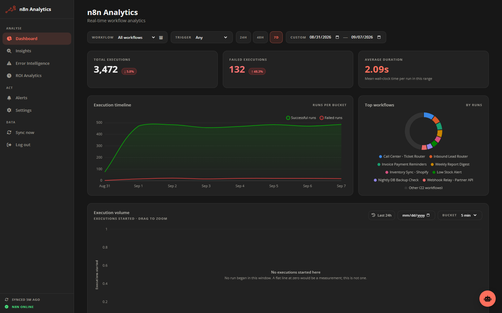
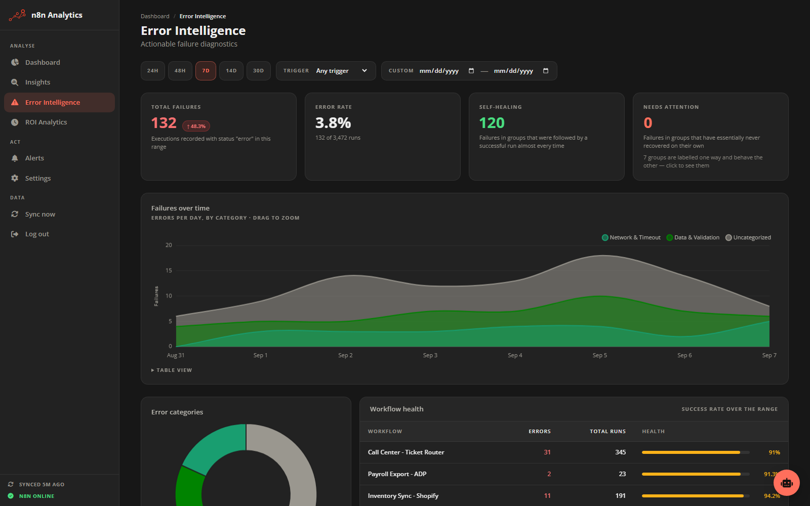
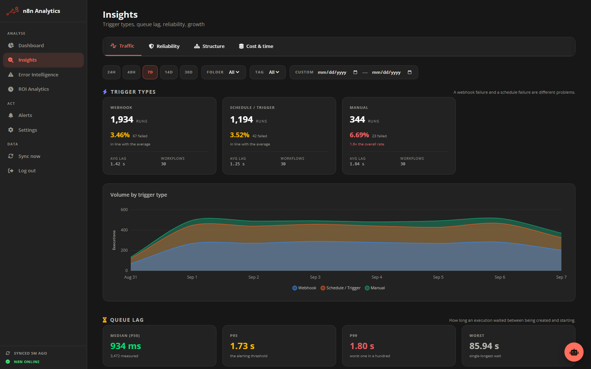
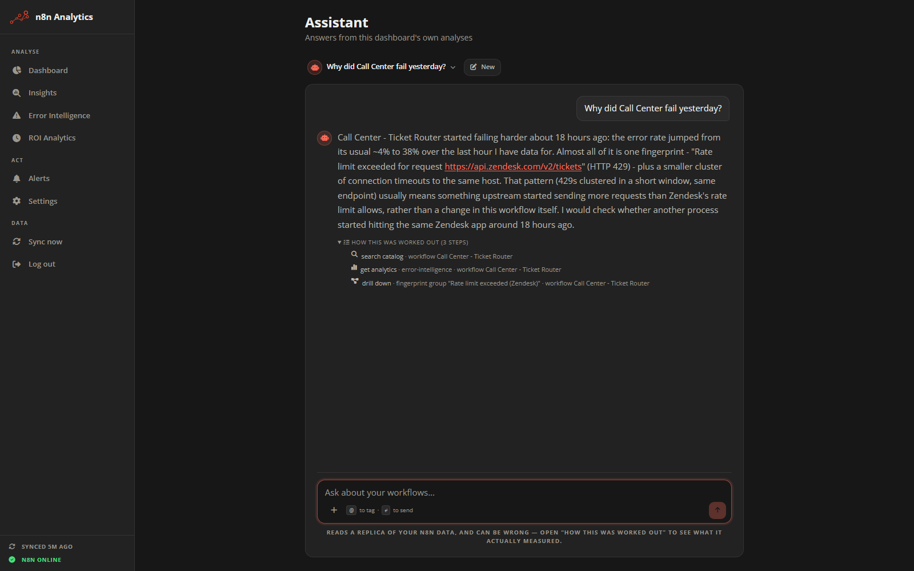
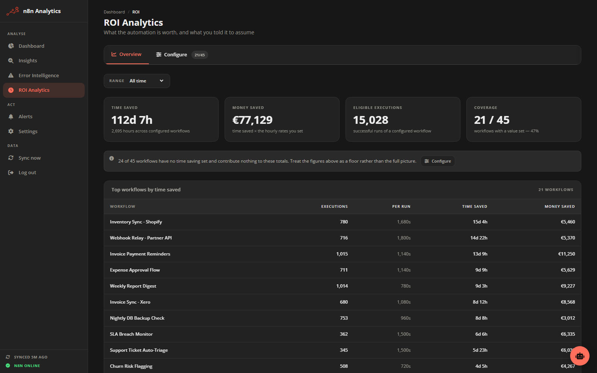
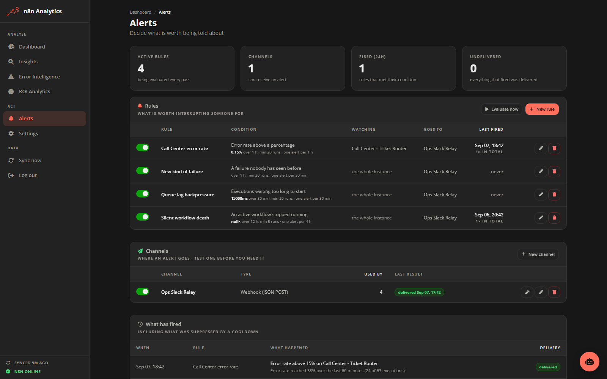

# n8n Analytics

Analytics for **self-hosted n8n**: long-horizon execution history, error
intelligence, and ROI — read straight out of your own n8n PostgreSQL, with no
workflow instrumentation and nothing leaving your infrastructure.



> [!NOTE]
> An **independent community project** — not affiliated with, endorsed by, or sponsored by n8n.io.

## Why this exists

n8n's answer to "how do I know when something breaks" is the Error Workflow, and
I used it for a long time. The problems with it are not small ones:

- **You have to set it on every workflow, one at a time.** Miss one and it is
  silently unmonitored — and you find out when someone asks why an automation
  stopped.
- **Then you are maintaining a Google Sheet.** That is where the errors land,
  and it is now a second thing that can fill up, get slow, or get edited by
  someone.
- **The error workflow can itself fail.** A parsing error inside the thing that
  reports your errors, and the reporting just stops. Nothing reports on the
  reporter.
- **It cannot tell you the source.** You get that something failed, not what
  set it off — and if a workflow has two triggers, you cannot tell which one
  produced the run.
- **It cannot group anything.** A thousand rows of the same broken HTTP call are
  a thousand rows.
- **It is 2–3 extra nodes inside every workflow.** Hand-fitted each time, adding
  noise to the thing you were trying to keep clean.

So I stopped trying to *collect* the data and looked at what was already there.
n8n writes every execution to PostgreSQL already — status, timing, trigger type,
the failed node, the stack. Nobody has to instrument anything for that to exist.
The question I actually built this around was:

> **given the data an n8n instance already produces, what analysis can you do
> that would be genuinely useful to the person running it?**

That is where the error fingerprinting came from, and the queue lag, and the
silent-death detection, and the rest. Not from a feature list — from working
backwards from the data.

It reads a read-only replica, so there are no extra nodes, nothing to remember
to set up, and it works retroactively on every execution you have already run.

## Quick start

```bash
git clone https://github.com/giorgoskoufos/n8n-analytics.git
cd n8n-analytics
cp .env.example .env    # fill in DASHBOARD_JWT_SECRET and your n8n Postgres credentials
docker compose up -d    # → http://localhost:3000
```

Six variables and you are running. Everything else has a working default —
[full reference](documentation/deployment/environment.md).

> [!TIP]
> **If your n8n Postgres also runs in Docker on this host**, `DASHBOARD_DB_HOST=127.0.0.1` will fail with `ECONNREFUSED`: inside a container, `127.0.0.1` *is* that container. Address it by service name instead — the commented network block at the bottom of [`docker-compose.yml`](docker-compose.yml) is exactly that, with instructions.

---

## What it looks like

**Error Intelligence** — every failure fingerprinted and grouped, so a hundred
occurrences of one broken thing read as one broken thing. Transient failures
that recovered on their own are separated from the ones that never did.



**Insights** — error rate split by how an execution was triggered, and queue lag
at p50/p95/p99. A webhook failure and a schedule failure are different problems,
and a blended rate hides both.



**The assistant** — asks the dashboard's own analyses rather than inventing
numbers, and shows every step it took to get there. Optional, and off until you
add an OpenAI key.



**ROI** — what the automation is worth, with an honest coverage indicator: it
tells you how much of your instance is actually configured, and treats the
totals as a floor rather than the full picture.



**Alerts** — seven rule types over webhook, Telegram or an n8n workflow,
including the one n8n cannot tell you itself: an active workflow that quietly
stopped running.



---

## Before you install

> [!IMPORTANT]
> **Hard requirements**
> 1. **Self-hosted n8n only** — the ETL needs direct database access.
> 2. **PostgreSQL only** — n8n's default SQLite backend is not supported.
> 3. **A persistent volume for the replica** — the compose file declares it for you. This is the single most common cause of reported data loss.
>
> Running more than one instance is *not* something to avoid — the app elects a single ETL writer on its own. See [documentation/deployment](documentation/deployment/README.md#running-more-than-one-instance).

> [!WARNING]
> **Verified on n8n 2.34.5 / PostgreSQL 17.** Other 2.x releases are expected to work — the ETL probes the schema and builds its queries from the columns that actually exist, rather than assuming a fixed shape. n8n 1.x is untested. A major n8n schema change may need a sync-job update; day-to-day analytics run off the local replica and are unaffected either way.
>
> Running a version that isn't listed? [Tell me what worked or broke](https://github.com/giorgoskoufos/n8n-analytics/issues) — that list is short only because one person is filling it in.

---

## Who this is for

If any of these are questions you have actually asked out loud, this is aimed
at you. They all need *history* and *grouping* rather than a single run, which
is why the execution log cannot answer them:

- Which workflow is quietly degrading, and since when?
- Of the 3,000 failures this month, how many distinct problems is that really?
- Which of those fixed themselves, and which have never once recovered?
- An active workflow stopped running two weeks ago and nobody noticed. Which?
- This credential expires Friday — what breaks?
- Are executions waiting longer to *start* than they used to?
- What is any of this actually worth in hours and money?

Four things make that possible:

- **Long-horizon history** — the replica keeps rows n8n has already deleted from PostgreSQL. Once synced, a row stays.
- **Zero load on production** — every analytics and AI query runs against the SQLite replica, never your n8n database.
- **Operational depth** — node-level failure analysis, blast-radius dependency mapping, ROI tracking, natural-language querying.
- **Your hardware, your data** — nothing leaves your infrastructure except the AI assistant's calls to OpenAI, which is entirely optional.

---

## What you get

- **Real-time metrics** — total executions, error counts, average runtimes, period-over-period deltas.
- **Execution timeline** — successes vs. errors over any window, with active-bucket forecasting so the current partial bucket doesn't read as a crash.
- **Error Intelligence** — node-level failure analysis, deduplicated error groups, category breakdown, and the upstream origin nodes that triggered each crash.
- **Trigger-type analysis** — every figure splittable by how an execution started. On the instance this was built against, webhooks fail at 4.0% and schedules at 1.1%, while a blended rate reported 3.9% for everything — a real number about the wrong thing.
- **Queue lag** — p50/p95/p99 wait between an execution being created and starting, with a backpressure signal that fires only when lag climbs while throughput doesn't. No n8n tool measures this.
- **Storage forecast** — which workflows the database's size actually comes from, and where it's heading, accounting for n8n's own pruning.
- **Retry-aware error rates** — raw and effective side by side, so a failure that succeeded on retry stops reading as an outage.
- **Error fingerprinting** — failures grouped by what actually broke, not by message text. 14,271 errors collapsed to 98 real groups on one instance.
- **Silent death detection** — an active workflow that quietly stopped running raises nothing in n8n. This learns each workflow's own cadence and flags the ones that missed it.
- **Blast radius** — which workflows share a credential or a node type. One credential on the reference instance is used by 42 workflows.
- **Deploy correlation** — error rates compared across saved versions of the same workflow, with author and timestamp — git blame for automations.
- **Node-level execution profiling** — where a workflow's time actually goes, node by node, including nodes that failed inside executions n8n recorded as successful.
- **Alerting** — seven rule types, delivered by webhook, Telegram, or an n8n workflow, with deduplication, cooldown, and a refusal to fire when the replica is too stale to judge.
- **ROI analytics** — per-workflow time-and-money-saved tracking, with a coverage indicator so a total from a partly-configured instance reads as the floor it is, not a measurement.
- **AI analytics assistant** — natural-language questions answered by calling the dashboard's own analyses, so its numbers can never disagree with the pages.
- **Folders, tags, and projects** — every figure filterable by n8n's own structure.
- **Security defaults** — JWT auth against your existing n8n users, rate limiting, a strict CSP, sanitized rendering, no write path to n8n at all.

---

## How it works

```
n8n PostgreSQL  ──ETL every 5 min──▶  dashboard.sqlite  ──▶  Express API  ──▶  Browser UI
   (read-only)                             ▲                                      │
                                            └────────  AI tools + read-only views  ◀────┘
```

The ETL copies a narrow set of columns — never workflow definitions, never credential contents, never payloads — from n8n's `workflow_entity` and `execution_entity` into the local replica, and extracts structured error detail from failed executions. Everything the dashboard renders, including the AI assistant's answers, is read from that replica.

PostgreSQL is touched in exactly four places, all of them reads: the ETL sync, login, on-demand execution trace fetches, and node profiling. Nothing in the codebase writes to your n8n database.

**→ Full mechanism, the 13-stage ETL pipeline, and the single-writer lock:** [documentation/architecture](documentation/architecture/README.md)

---

## Installing

Docker Compose is the recommended path and is at the top of this file. The
details below cover everything else.

> [!CAUTION]
> **A volume at `/data` is required.** The replica holds history n8n has already pruned and **cannot be rebuilt from the source database**. Without one, every redeploy destroys the archive. Both compose files declare it for you; if you deploy some other way, mount it yourself.

| File | Use |
|---|---|
| [`docker-compose.yml`](docker-compose.yml) | Pulls the published image. Nothing to build. |
| [`docker-compose.build.yml`](docker-compose.build.yml) | Builds from this checkout — for contributors and unreleased commits: `docker compose -f docker-compose.build.yml up -d --build` |

### Running from source

For development. Node 20+ (the image and CI both use 22).

```bash
npm install
cp .env.example .env
npm start                # → http://localhost:3000
```

**→ Full environment reference, PaaS setup, upgrading, backup and restore:** [documentation/deployment](documentation/deployment/README.md)

---


## Documentation

Reference documentation lives in [`documentation/`](documentation), one topic per folder. This README stays a map and a quick start; each of these goes deep on its own subject.

| Folder | Covers |
|---|---|
| [architecture](documentation/architecture/README.md) | The request lifecycle, the 13-stage ETL pipeline, the single-writer lock, graceful shutdown |
| [database](documentation/database/README.md) | Every table — what's mirrored from n8n, what's dashboard-only, and the `ai_*` views |
| [api](documentation/api/README.md) | Every REST endpoint: method, path, auth level, params |
| [backend](documentation/backend/README.md) | Code layout, the DAO convention, scope vs. grouping, how to add an endpoint |
| [frontend](documentation/frontend/README.md) | The no-bundler vanilla-JS frontend, page structure, the auth guard, adding a page |
| [ai](documentation/ai/README.md) | The assistant: what it can answer ([how-it-works.md](documentation/ai/how-it-works.md)) and how it's built ([developers.md](documentation/ai/developers.md)) |
| [integrations](documentation/integrations/README.md) | Step-by-step: connecting OpenAI, the n8n documentation lookup, and alert channels |
| [security](documentation/security/README.md) | What's synced and what isn't, the AI sandbox, secrets, auth, rate limits |
| [operations](documentation/operations/README.md) | Logs, health, alerting reference, retention, troubleshooting |
| [deployment](documentation/deployment/README.md) | Full install reference: environment variables, Docker, backup/restore, upgrading |

---

## Getting started, by scenario

A few concrete starting points, each pointing at the doc that finishes the job.

**"I just deployed this — what do I do first?"**
Log in with your n8n credentials. The dashboard starts syncing immediately; a first-run screen shows a percentage while it fills in. It's usually done in minutes, not hours — see [First sync](documentation/deployment/README.md#first-sync). Nothing else is required to see your data.

**"I want the AI assistant answering questions in chat."**
Settings → Assistant → paste an OpenAI API key → Save. That's the whole setup — see [Connecting the assistant](documentation/integrations/README.md#the-ai-assistants-model-and-api-key). Ask it something like *"which workflow failed most this week?"* and open *"How this was worked out"* under the answer to see exactly which analyses it ran.

**"I want a Telegram message the moment a workflow starts failing."**
Alerts → New channel → Telegram, then Alerts → New rule → *"Error rate above a percentage."* Full walkthrough with exact fields: [Alert channels](documentation/integrations/README.md#alert-channels).

**"My n8n prunes executions after a few days and I want longer history."**
This dashboard already keeps everything it's synced, forever, by default. Raise n8n's own retention window if you also want n8n's editor UI to see further back — see [Enabling deep historical analytics](documentation/deployment/README.md#first-sync).

**"One workflow is slow and I don't know why."**
Open its error/insights drill-down, or just ask the AI assistant *"why is `<workflow>` slow, where does the time go?"* — it profiles node by node. See [Node-level execution](documentation/ai/how-it-works.md#what-is-slow-and-where-the-time-goes).

**"I'm a developer and want to add a new metric."**
One function in a DAO, one entry in a controller/route, done — and if it should also be askable in chat, one more entry reusing the same DAO call. See [Adding a new endpoint](documentation/backend/README.md#adding-a-new-endpoint) and [Adding an analysis](documentation/ai/developers.md#adding-to-it).

**"I want to know exactly what data leaves my infrastructure."**
Nothing, except calls to OpenAI if you've configured the AI assistant — and even those never include raw customer data. Full breakdown: [What's synced](documentation/security/README.md#what-gets-copied-out-of-n8n-and-what-deliberately-does-not).

---

## Authentication

No separate user system — this dashboard authenticates directly against your existing n8n users. Log in with the same email and password; a `bcrypt` comparison runs against n8n's own `user` table, and disabled or MFA-enabled n8n accounts are rejected here too. Authorization mirrors n8n's own project model: owners and admins see everything, everyone else sees only workflows in their own projects.

**→ Full model, including why the AI assistant is scoped differently from instance-wide settings:** [documentation/security](documentation/security/README.md#authentication)

---

## AI Chat Assistant

> **In depth:** [documentation/ai/how-it-works.md](documentation/ai/how-it-works.md) — what you can ask it, what it refuses, and how to check an answer. No code. [documentation/ai/developers.md](documentation/ai/developers.md) — the request lifecycle, the four safety mechanisms, and how to add an analysis.

The assistant answers by calling the dashboard's own analyses rather than by writing queries. Ask *"why did Call Center fail yesterday"* and it looks up what *Call Center* is, reads the error intelligence for that folder, and drills into the group that stands out — the same steps a person would take.

It reaches 21 fixed analyses, a searchable catalogue of every workflow/folder/tag/error group, and optionally the official n8n documentation. It **cannot** reach execution payloads, raw error messages, stack traces, credentials, or other users' conversations — not by application-level filtering, but because those columns are absent from the SQLite views its connection can even see. See [documentation/security](documentation/security/README.md#the-ai-assistants-sandbox-briefly) for the four independent layers behind that guarantee.

Requires an OpenAI API key, set in **Settings → Assistant**; the rest of the dashboard works without one.

---

## Stack

**Backend** — Node.js + Express 5, modular MVC (routes → controllers → DAOs). No ORM; hand-written SQL behind a shared scoping layer. See [documentation/backend](documentation/backend/README.md).

**Frontend** — vanilla JS, no framework, no bundler, no build step except Tailwind CSS (which is compiled). Every third-party script is vendored, not loaded from a CDN. See [documentation/frontend](documentation/frontend/README.md).

**Database** — SQLite, applied through an ordered, idempotent set of migrations. WAL journaling, a 5s busy timeout, and indexes covering the dashboard's own access patterns. See [documentation/database](documentation/database/README.md).

```bash
npm run lint     # eslint
npm test         # node --test: unit + integration
npm run check    # both — the same gate CI applies before deploying
```

---

## Operating it

Logs are split into a narrative console and a complete structured file, health is visible in the sidebar of every page, and retention is configurable per column. None of it requires an external observability stack to start.

**→ Full reference:** [documentation/operations](documentation/operations/README.md)

---

## FAQ

**How is this different from n8n's own Insights?**
They answer different questions. n8n's Insights is a paid feature (on Cloud and
self-hosted alike — a Business or Enterprise licence key unlocks it) and tells
you how your instance is doing inside a retention window: 30 days on Business,
365 on Enterprise. This keeps history **permanently**, including rows n8n has
already pruned out of PostgreSQL, and spends its effort on things n8n does not
do at all — grouping failures by fingerprint, queue lag percentiles, silent
death detection, credential blast radius, ROI. Run both if you like; they do not
overlap much.

**Does it write to my n8n database?**
No. Read-only credentials are enough, and that is the recommended setup.

**Does it need my workflows changed?**
No. No extra nodes, no webhooks, no logging step. It reads the execution history
your instance has already produced, so it works retroactively on everything you
have run so far.

**Does it work with n8n's SQLite backend?**
No — PostgreSQL only. The ETL needs direct database access to a schema n8n's
SQLite deployments don't expose the same way.

**Does anything leave my server?**
Not unless you switch it on. There is no telemetry of any kind. The optional
outbound calls — OpenAI, the n8n docs lookup, and any alert channel you
configure — are listed in
[documentation/security](documentation/security/README.md#what-leaves-your-infrastructure).

**Do I need an OpenAI key?**
Only for the assistant. Everything else works without one, and the app degrades
cleanly if you never add it.

---

## If you find this useful

It is one person's project, and the honest limit on it is that I only have one
n8n instance to test against. That is where help matters most:

- **Run it and tell me what happened** — especially on an n8n version other than
  2.34.5, on a much larger instance, or on ARM. "It worked" is genuinely useful
  information, not just bug reports.
- **Tell me if a number looks wrong.** You know your own instance better than
  this dashboard does. If a figure doesn't match what you'd expect, that is
  worth an issue even if you can't say why.
- **Say what's missing.** The analyses here are the ones I needed. Yours are
  probably different.
- **Code, if you feel like it.** [CONTRIBUTING.md](CONTRIBUTING.md) has the
  setup and the three things that are easy to get wrong. Small PRs and docs
  fixes are very welcome; open an issue first for anything large so we don't
  both build it.
- **A star helps**, mostly because it is how other people find it.

I read everything, and I'd rather have an issue that turns out to be my
misunderstanding than a silent user who gave up.

---

## Licence

MIT — see [LICENSE](LICENSE). Use it, fork it, run it commercially; just keep
the copyright notice.

Third-party code served to the browser is vendored under
[`public/vendor/`](public/vendor), with every licence and attribution collected
in [`public/vendor/LICENSES.md`](public/vendor/LICENSES.md).

**Not affiliated with n8n.** This is an independent community tool. "n8n" is a
trademark of n8n GmbH, used here only to describe what this software works
with. It is not endorsed or sponsored by them.

**No warranty.** This connects to your production database. It only ever reads,
and read-only credentials are enough — but it is provided as-is, under the
terms in [LICENSE](LICENSE).
